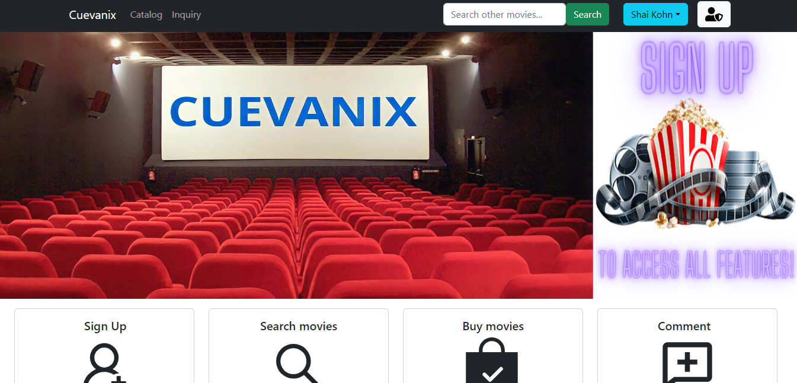
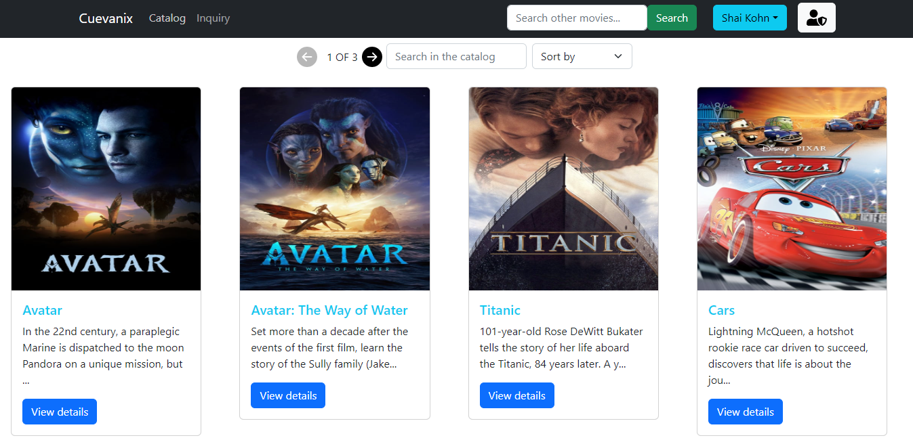
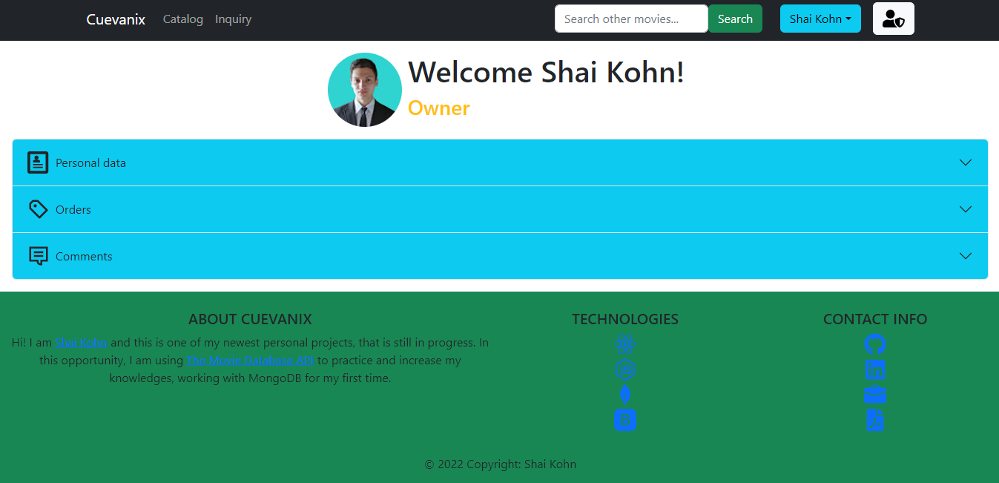
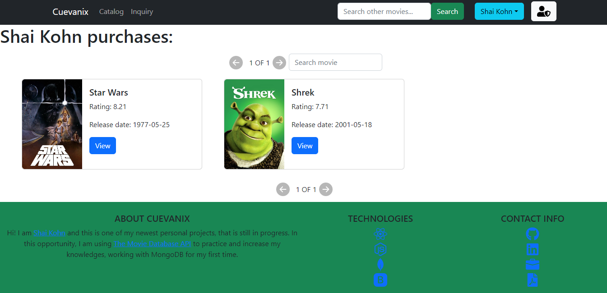
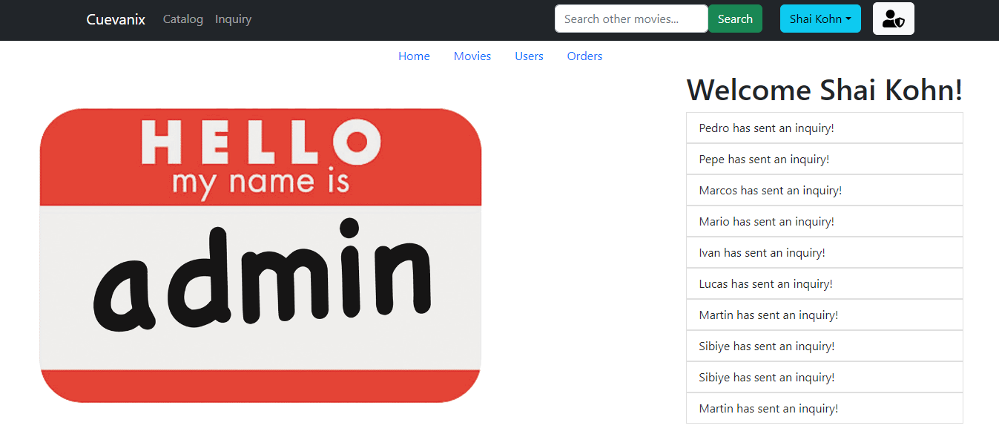
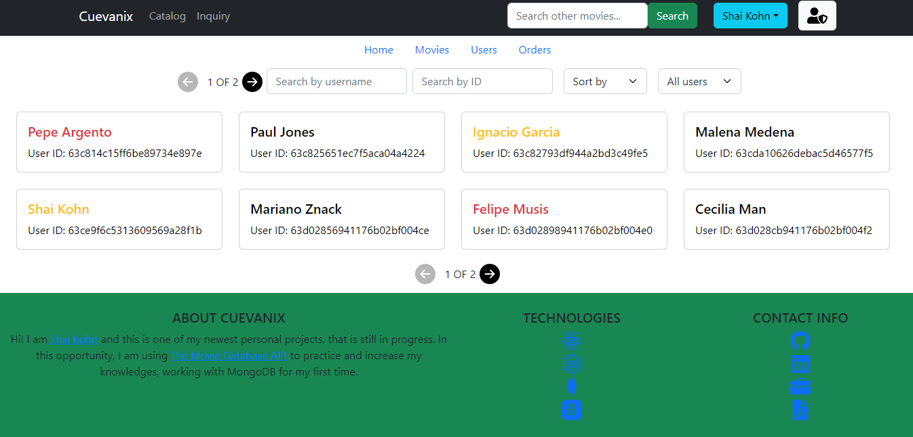

# CUEVANIX

## Introduction

This is a personal project done with the objetive of practice React and Node JS, while learning MongoDB.

## Project Objetives

- Build a JavaScript App from scratch
- Afirm and conect all the learned concepts in the Carreer 
- Learn and practice GIT workflow / team work
- Use scrum agile methodology

## Stack of Technologies

### Front End:
HTML, CSS, Javascript, React, Bootstrap, Redux-Toolkit

### Back End:
Node.js, Express, Json web token authentication, Courier, Sequelize.

### Database:
MongoDB

## Resume
This project consists of a movie e-commerce, in which the user can buy movies, search movies, make inquiries, leave comments, view the trailers of my purchased movies. For their part, administrators can review and respond to user inquiries, edit and delete movies, review purchase orders, view all users and their details. Finally, the owner can do all of the above, plus the ability to promote and demote users, and ban and unban users.

# Project Screens

