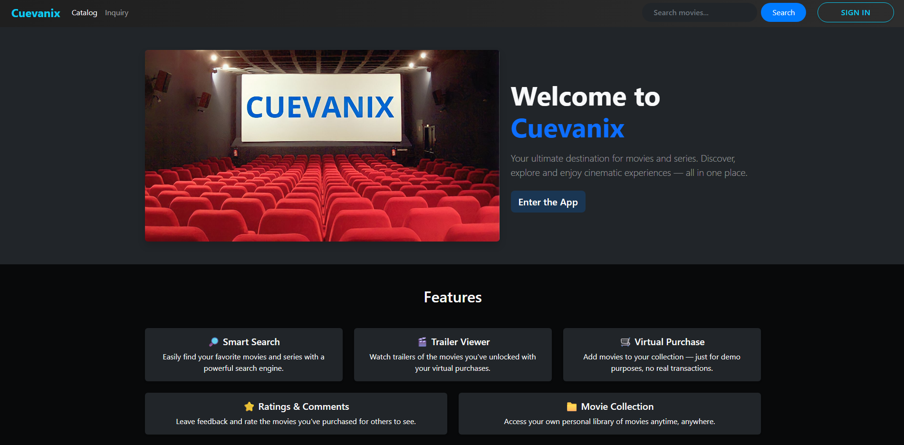
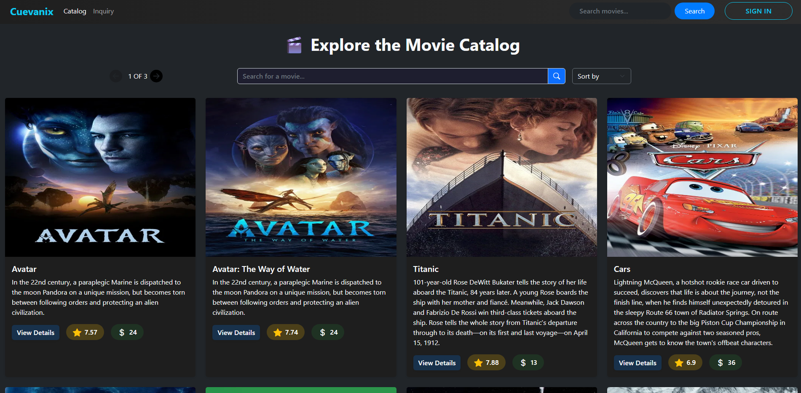
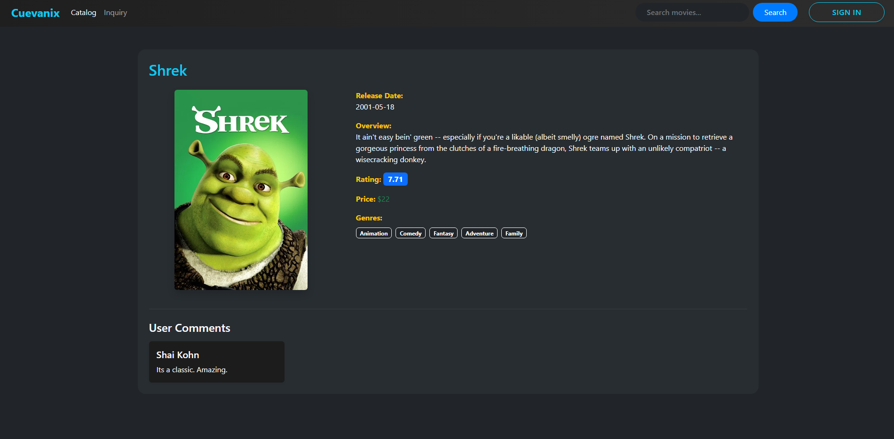
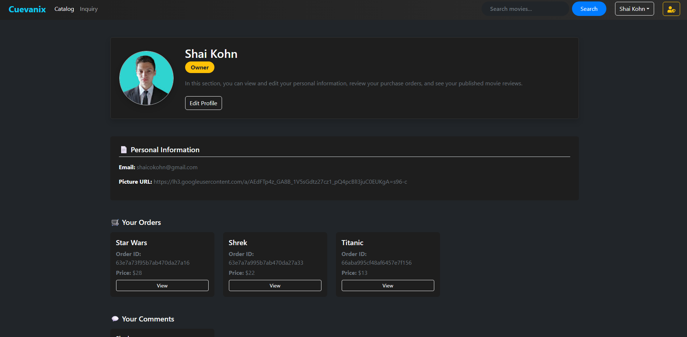

# 🎬 Cuevanix

Cuevanix is a full-stack web application that simulates an online movie store and streaming service. Users can browse and search for movies, view details, filter and sort the catalog, add movies to their cart, and simulate purchases through Stripe. It also includes user registration/login, an admin panel for bans, and comment/inquiry systems.

> 🚧 This project was developed individually for educational purposes and practice. All purchases are simulated and no real transactions are made.

---

## ✨ Features

- 🔐 Local and Google authentication system
- 🔍 Movie catalog with search, filtering, and sorting
- 💳 Movie purchase system using **Stripe**
- 🗨️ Comment and inquiry system
- 🛡️ Admin panel for user banning and moderation
- 🌐 Uses **THE MOVIE DATABASE** API for external movie data

---

## 📸 Screenshots

### 🏠 Landing Page


### 🎞️ Movie Catalog


### 🎬 Movie Detail


### 👤 User Profile


---

## ⚙️ Technologies Used

- **Frontend:** React, Redux Toolkit, Bootstrap
- **Backend:** Node.js, Express, MongoDB
- **Auth:** JWT, Google OAuth
- **Payments:** Stripe
- **API Consumption:** THE MOVIE DATABASE
- **Other:** Mongoose, Nodemailer, dotenv

---

## 🧪 Simulated Payments with Stripe

To simulate purchases in Cuevanix, you must use test cards provided by Stripe (these are displayed on the checkout page).

✅ No real payments are made — it’s a secure testing environment.

📌 **Important:** Only Stripe test cards will work. Using real card data will result in failed transactions.

---

## 🚀 Getting Started

### 1. Clone the repository

```bash
git clone https://github.com/Shaikohn/Cuevanix.git
cd Cuevanix

```
### 2. Install dependencies

```bash
# Client
cd client
npm install

# api
cd ../api
npm install

```

### 3.  Setup your .env files
Create two .env files:

# 📁 client/.env:

```bash

REACT_APP_CLIENT_ID=your_client_id
REACT_APP_STRIPE=your_stripe_public_key

```
# 📁 api/.env:

```bash

PORT=your_port
CONNECTION_URL=your_mongodb_connection_string
APIKEY=your_api_key
STRIPE_KEY=your_stripe_secret_key
MAIL_USER=your_email_address
MAIL_PASS=your_email_password

```

### 4.  Run Locally

```bash
# client
cd ../client
npm start

# api
cd ../api
npm start

```

## 🙌 Credits
This project was created individually for learning purposes. All features are part of a simulated environment and are not intended for production use.